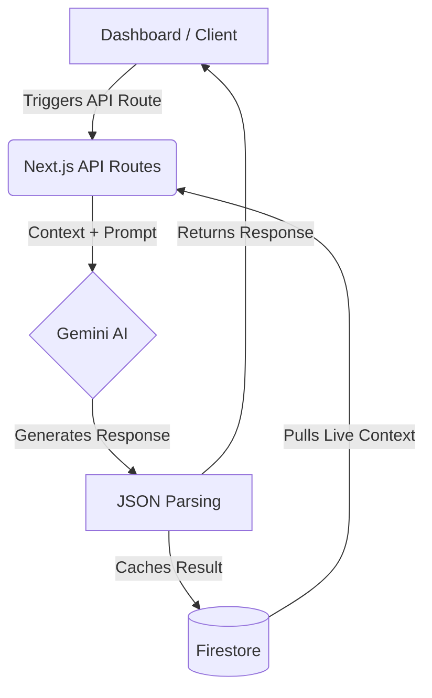
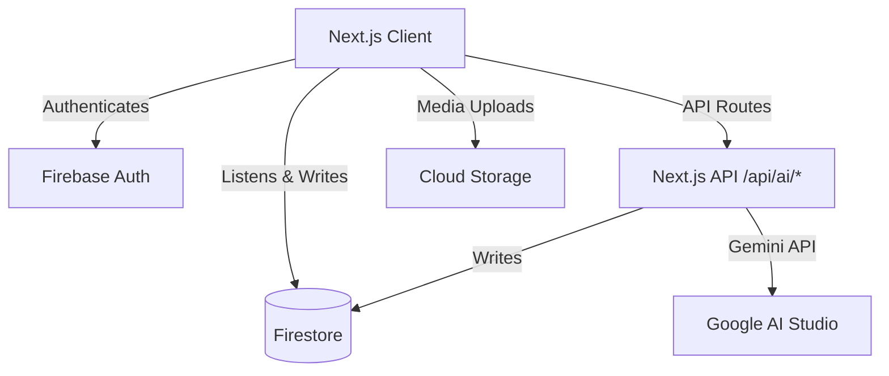

<div align="center">
  

  <h1>Stadium AI Copilot</h1>
  <p><strong>Intelligent orchestration and operational awareness for modern mega-venues.</strong></p>

  <p>
    
    
    
    
    
    
  </p>
</div>

---

## 🌪️ The Problem

Managing operations for a stadium holding 50,000+ attendees is a monumental logistical challenge. Modern mega-venues suffer from extreme operational complexity:

- **Crowd Congestion:** High-density surges in concourses and gates that lead to severe safety risks.
- **Medical Emergencies:** Localized casualties that are difficult to pinpoint and triage amidst the noise.
- **Operational Awareness:** Blind spots caused by siloed systems (ticketing, security, weather, facilities).
- **Decision Latency:** The critical lag between when an incident occurs and when a coordinated response is deployed.
- **Fragmented Information:** Security personnel and medical teams operating on entirely different communication protocols.

---

## 💡 The Solution

**Stadium AI Copilot** is a real-time, AI-native command center built to unify mega-venue operations.

We believe that AI should **assist** human operators—not replace them. By combining real-time telemetry from Firebase with Google's Gemini AI (via Google AI Studio), the Copilot rapidly synthesizes chaotic environmental data into structured, actionable intelligence. This empowers stadium staff to proactively mitigate risks before they escalate.

---

## ✨ Core Features

### Live Operations Dashboard

A unified, birds-eye view of the stadium's pulse. Monitor live crowd density, active gates, match status, and weather telemetry seamlessly.

> ``

### Real-time Firestore Sync

Leverages Firestore `onSnapshot` listeners to ensure every operator across the stadium is looking at the exact same data instantly, with zero polling.

### Incident Operations Center

A comprehensive CRUD system for tracking operational friction. Operators can log, update, and resolve incidents (Medical, Security, Crowd, Infrastructure) instantly.

> ``

### AI Incident Intelligence

On-demand context synthesis. When an incident occurs, operators can trigger Gemini AI to read the event details against live stadium telemetry, instantly returning a structured risk assessment, root cause analysis, and recommended mitigation strategies.

> ``

### AI Stadium Operations Briefing

An automated, executive-level situation report. Gemini AI evaluates all active incidents and telemetry to produce a holistic operational risk score and proactive recommendations.

### AI Scenario Simulator

A read-only sandbox for disaster preparedness. Operators can simulate hypothetical scenarios (e.g., "Medical emergency in Sector 4" or "Transit Disruption") against _current_ live conditions to predict downstream bottlenecks and plan responses.

> ``

---

## 🧠 AI Architecture

Our AI integrations prioritize extreme reliability, speed, and safety by enforcing a strictly structured JSON pipeline.



---

## 🏗️ System Architecture

Built on a robust, serverless, highly-scalable stack.



---

## 🗄️ Firestore Collections

The data layer is normalized for optimal read performance:

- **`users`**: RBAC profiles for operators, medical staff, and security.
- **`stadiums`**: High-level telemetry (weather, gate status, match state).
- **`matches`**: Ongoing and historical match schedules.
- **`incidents`**: Real-time logs of security, medical, and crowd events.
- **`alerts`**: System-generated high-priority push notifications.

---

## 📂 Folder Structure

```text
stadium-ai-copilot/
├── src/
│   ├── app/                    # Next.js App Router structure
│   ├── components/             # Reusable UI & Layouts (shadcn/ui)
│   ├── constants/              # Global application settings
│   ├── features/               # Feature-driven architecture modules
│   │   ├── dashboard/
│   │   ├── incidents/
│   │   ├── simulator/
│   │   └── stadium/
│   ├── hooks/                  # Custom React hooks (Firestore listeners)
│   ├── lib/                    # Core utilities & Firebase config
│   │   ├── firebase/
│   │   ├── data/
│   │   └── utils/
│   └── types/                  # Global frontend TS interfaces
├── .firebaserc
├── firebase.json
├── firestore.rules
└── firestore.indexes.json
```

---

## 🛠️ Technology Stack

- **Next.js 15 (App Router)**: Provides the optimal blend of Server Components (for security/SEO) and Client Components (for real-time interactivity).
- **React 19**: Leverages the latest concurrent rendering features for a fluid UI.
- **TypeScript (Strict)**: Eradicates entire classes of runtime errors through rigorous type safety.
- **Tailwind CSS & shadcn/ui**: Enables rapid, accessible, and radically beautiful UI development without bloated CSS bundles.
- **Firebase / Firestore**: Delivers instantaneous data synchronization across thousands of operator clients.
- **Google AI Studio (Gemini API)**: Fast, lightweight AI reasoning using `gemini-2.5-flash-lite-preview-06-17`.

---

## 🔒 Security

Security is non-negotiable for stadium operations.

- **Backend-only AI**: Gemini AI is accessed **exclusively** via Next.js API routes (`/api/ai/*`). No API keys ever touch the browser.
- **Server-Only Boundaries**: Utilizes the `server-only` package to guarantee that Firebase Admin credentials cannot physically leak into the client bundle.
- **Environment Validation**: `zod` strictly parses and validates all environment variables (`src/env.ts`) at startup. The build fails instantly if a secret is missing.
- **Firestore Rules**: Granular, authenticated-only read/write access defined in `firestore.rules`.
- **Firebase App Check**: Ready to be enabled to prevent abuse of the backend infrastructure.

---

## ♿ Accessibility (WCAG AA)

Designed for operators of all abilities, especially under high-stress conditions:

- Comprehensive **Keyboard Navigation** across all tables, forms, and interactive maps.
- Explicit **Focus States** (`focus-visible:ring`) to guide keyboard users.
- Thorough **ARIA Attributes** (`aria-label`, `aria-pressed`, `aria-hidden`) ensuring robust screen reader compatibility.

---

## ⚡ Performance

- **Lazy Loading**: Heavy components like the dynamic SVG `StadiumLayoutMap` are deferred using `next/dynamic` to shrink the initial JS payload.
- **Realtime Listeners**: Minimal overhead `onSnapshot` subscriptions prevent unnecessary network polling.
- **Optimistic UI**: Operations (like resolving incidents) update the local state instantly while the Firestore transaction completes in the background.

---

## 💻 Local Development

### 1. Installation

```bash
git clone https://github.com/your-username/stadium-ai-copilot.git
cd stadium-ai-copilot
npm install
```

### 2. Environment Setup

Copy the example environment file and populate your Google Cloud / Firebase keys:

```bash
cp .env.example .env.local
```

### 3. Cloud Functions (Backend)

```bash
cd functions
npm install
npm run build
```

### 4. Run the Client

```bash
npm run dev
```

Access the application at `http://localhost:3000`.

---

## 🏆 Demo Workflow (For Judges)

To thoroughly evaluate the technical depth of Stadium AI Copilot:

1. **Dashboard Overview**: Navigate to the Overview. Observe the real-time telemetry (Weather, Crowd Status). Note the dynamic SVG rendering of the stadium map.
2. **AI Briefing**: Click "Refresh Briefing" on the top right. Watch the API route call Gemini AI, passing the live telemetry, and rendering a highly structured, cached risk assessment.
3. **Incident Creation**: Navigate to the Incidents tab. Create a new incident (e.g., "Medical emergency in Sector 4"). Watch the optimistic UI update instantly.
4. **AI Intelligence**: Click on the new incident to open the detail drawer. Click the "Analyze Incident" action. Observe the backend synthesizing the incident details against the live crowd data to produce a targeted mitigation plan.
5. **Scenario Simulation**: Navigate to the Simulator tab. Select a hypothetical disaster (e.g., "Severe Weather") and click "Run Simulation". Verify the read-only AI predicts operational bottlenecks dynamically based on the active state of the stadium.

---

## 🚀 Future Roadmap

- **CCTV Computer Vision Integration**: Pipe live camera feeds into Gemini Vision to automatically detect crowd surges and create incidents without human intervention.
- **Wearable Health Sync**: Integrate with medical staff wearables for real-time biometric tracking during crisis response.
- **Multi-Stadium Orchestration**: Expand the architecture to support regional command centers managing multiple venues simultaneously.

---

## 📄 License

This project is licensed under the MIT License.
